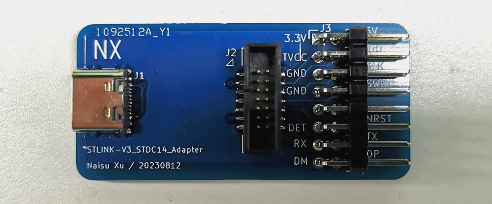
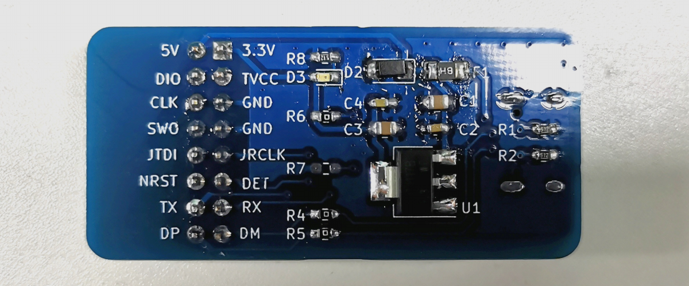
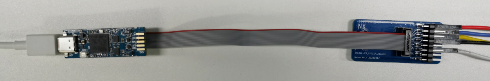
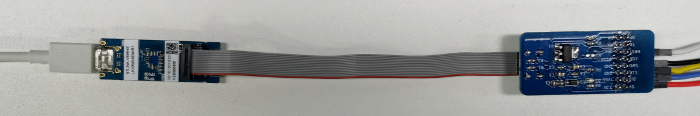
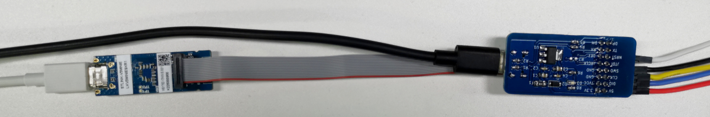

# STLINK-V3_STDC14_Adapter

## Brief

An adapter board for STLINK-V3. It change the STDC14 to 2.54mm pin header.It also provides 5V and 3.3V power supply through an additional USB interface.

This project is designed with [Kicad](https://www.kicad.org/).

## Images

## License
 This work is licensed under a <a rel="license" href="http://creativecommons.org/licenses/by-sa/4.0/">Creative Commons Attribution-ShareAlike 4.0 International License</a>.

